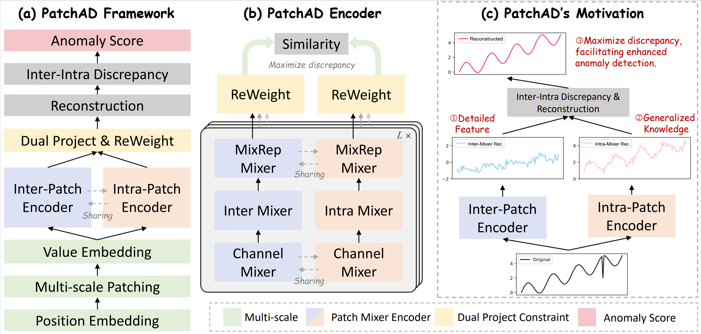
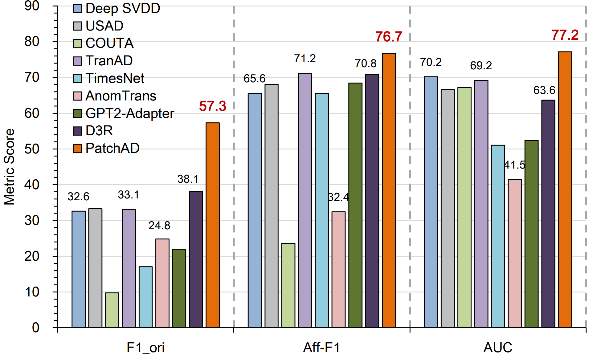
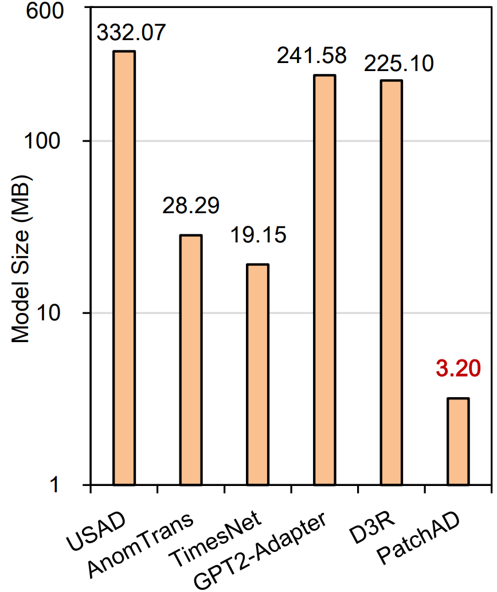

# PatchAD
This is the implementation of *PatchAD: A Lightweight Patch-based MLP-Mixer for Time Series Anomaly Detection*.

You can download the paper from [arivx](https://arxiv.org/abs/2401.09793).

# Abstract
Anomaly detection in time series analysis is a pivotal task, yet it poses the challenge of discerning normal and abnormal patterns in label-deficient scenarios. While prior studies have largely employed reconstruction-based approaches, which limits the models' representational capacities. Moreover, existing deep learning-based methods are often not sufficiently lightweight. Addressing these issues, we present PatchAD, our novel, highly efficient multi-scale patch-based MLP-Mixer architecture that utilizes contrastive learning for representation extraction and anomaly detection. With its four distinct MLP Mixers and innovative dual project constraint module, PatchAD mitigates potential model degradation and offers a lightweight solution, requiring only **3.2MB**. Its efficacy is demonstrated by state-of-the-art results across **nine** datasets, outperforming over **30** comparative algorithms. PatchAD significantly improves the classical F1 score by **50.5\%**, the Aff-F1 score by **7.8\%**, and the AUC by **10.0\%**. The code is publicly available.

## Architecture

## Overall Performance \& Model Size

  
  

## Citation

**If you find this repo useful, please cite our paper.**
> @misc{zhong2024patchad,  
&nbsp;&nbsp;&nbsp;&nbsp;title={PatchAD: A Lightweight Patch-based MLP-Mixer for Time Series Anomaly Detection},  
&nbsp;&nbsp;&nbsp;&nbsp;author={anonymous authors},  
&nbsp;&nbsp;&nbsp;&nbsp;year={2024},  
&nbsp;&nbsp;&nbsp;&nbsp;eprint={2401.09793},  
&nbsp;&nbsp;&nbsp;&nbsp;archivePrefix={arXiv},  
&nbsp;&nbsp;&nbsp;&nbsp;primaryClass={cs.LG}  
}

